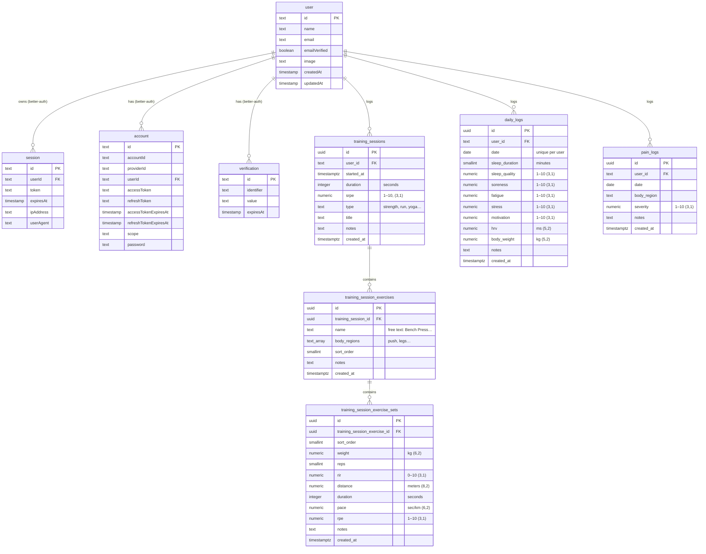
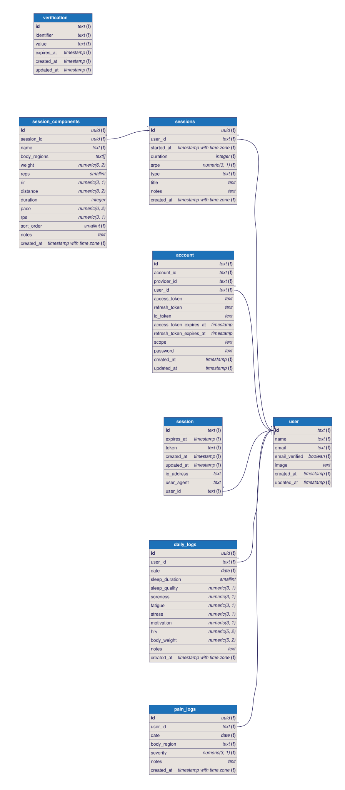

# WOT — Entity Relationship Diagram

> Source of truth: `api/src/db/schema/`. Regenerate the SVG with
> `npm run db:erd` from `api/` (uses `drizzle-erd`).

## Notes

- `user`, `session`, `account`, `verification` are owned by `better-auth` —
  app tables reference `user.id` (`text`) but don't define it.
- Core load formula: `session load = duration × srpe`. All higher-order
  metrics (weekly load, monotony, strain, ACWR) are derived at query time.
- `daily_logs` has a unique `(user_id, date)` index.
- `pain_logs` and `daily_logs` are intentionally decoupled from `training_sessions`.

## Generated SVG

